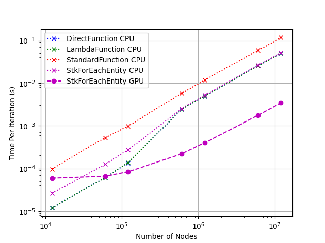

# stk_ngp_basic

Basic testing for `stk` on the GPU

## Overview

To get started, see the [build instructions](#building-with-spack) below.

These examples, implemented as unit tests, show some basic usage of `stk_ngp` and include some benchmarking of different loop abstractions.

## Benchmark Results

Among the unit tests, various loop abstractions were benchmarked. They consisted of:

- `DirectFunction`: Just calling a function the directly implements the operation.
- `LambdaFunction`: The operation is implemented in a lambda function.
- `StandardFunction`: The operation is implemented in a `std::function`.
- `StkForEachEntity`: Using `stk-ngp` `for_each_entity_run` abstraction that can run on the GPU or CPU.

The operation was a simple operation where two nodal field values and a scalar were used to update a third nodal field:
$v^{Ij}_{n+1} = v^{Ij}_n + \Delta t * a^{Ij}_n$
where $Ij$ corresponds to node $I$ and degree-of-freedom $j$.
or
`velocity_data_np1(node_i, dof_j) = velocity_data_n(node_i, dof_j) + time_increment * acceleration_data_n(node_i, dof_j)`
each operation was run thousands of times and the average time per iterations was calculated.

Benchmarking was completed on an [Azure Standard_NC4as_T4_v3](https://learn.microsoft.com/en-us/azure/virtual-machines/nct4-v3-series) instance. With 4 cores on a AMD EPYC 7V12(Rome) CPU with 28 Gb or memory and a Nvidia Tesla T4 GPU. The run times are shown below. The `DirectFunction` and `LambdaFunction` had nearly identical performance. As implemented, the `StkForEachEntity` loop had a bit more initial overhead causing a small performance hit, noticeable for very fast iterations (low number of nodes) but negligible for slower iterations. The GPU runs for `StkForEachEntity` show the advantage of using the GPU if the workload is high enough (higher number of nodes).



## Building with Spack

### Install Spack

Follow the instructions at [https://spack.readthedocs.io/en/latest/getting_started.html](https://spack.readthedocs.io/en/latest/getting_started.html). In short, install the `spack` prerequisites, clone `spack`, and source the script for shell support.

### Find System Tools

```bash
# Add system compilers. e.g. gcc
spack compiler find

# Use external tools. e.g. cmake
spack external find
```

### Create a Spack Environment

```bash
# Create and activate a spack environment for the project
spack env create stk-ngp-basic
spacktivate stk-ngp-basic
```

### Add and Install Required Packages

#### With GPU

```bash
# If needed, specify a specific compiler. For example, add `%gcc@10.5.0` at the end of the `spack add` commands
# Add kokkos and Trilinos, adjust cuda_arch as needed for your GPU device
spack add kokkos +cuda +cuda_lambda +cuda_relocatable_device_code ~cuda_uvm ~shared +wrapper cuda_arch=75 cxxstd=17
spack add trilinos +boost +cuda +cuda_rdc +exodus +gtest +hdf5 ~shared +stk ~uvm +wrapper +zoltan +zoltan2 cuda_arch=75 cxxstd=17
spack add googletest

# Install Packages
spack install
```

#### Without GPU

```bash
# If needed, specify a specific compiler. For example, add `%gcc@10.5.0` at the end of the `spack add` commands
# Add kokkos and Trilinos
spack add kokkos ~cuda ~shared cxxstd=17
spack add trilinos +boost ~cuda +exodus +gtest +hdf5 ~shared +stk +zoltan +zoltan2 cxxstd=17
spack add googletest

# Install Packages
spack install
```

---

### Notes on Specific Installs

#### Ubuntu 22.04, x86_64, AWS EC2 g4dn.xlarge

Successfully installed on an AWS EC2 g4dn.xlarge (NVIDIA T4 GPU) Ubuntu 22.04 system using `apt-get` to install prerequisites:

- `gcc@10.5.0`

Also, to update the nvidia drivers:

```bash
sudo ubuntu-drivers install --gpgpu
```

#### Ubuntu 20.04, x86_64, Azure VM Standard NC4as T4 v3 (4 vcpus, 28 GiB memory)

Followed same procedure as the AWS EC2 instance above.
